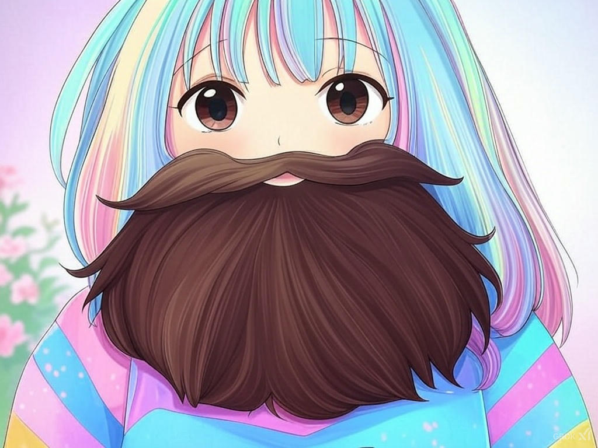
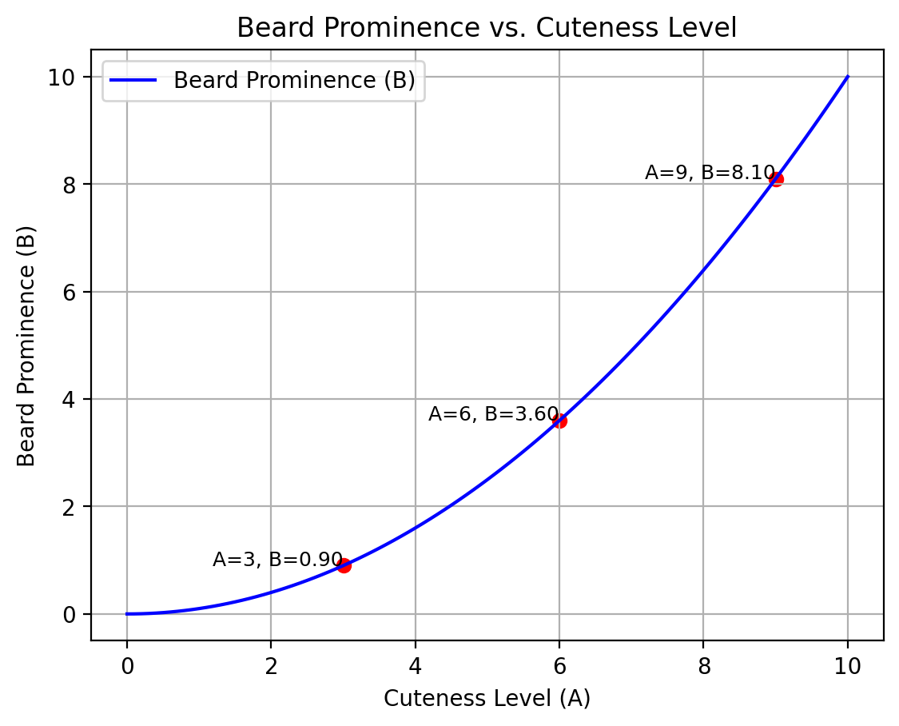
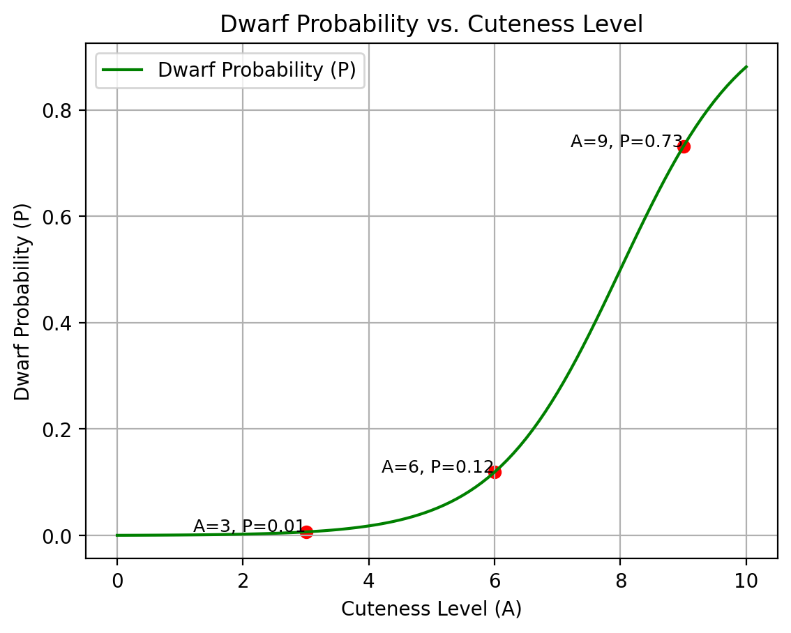
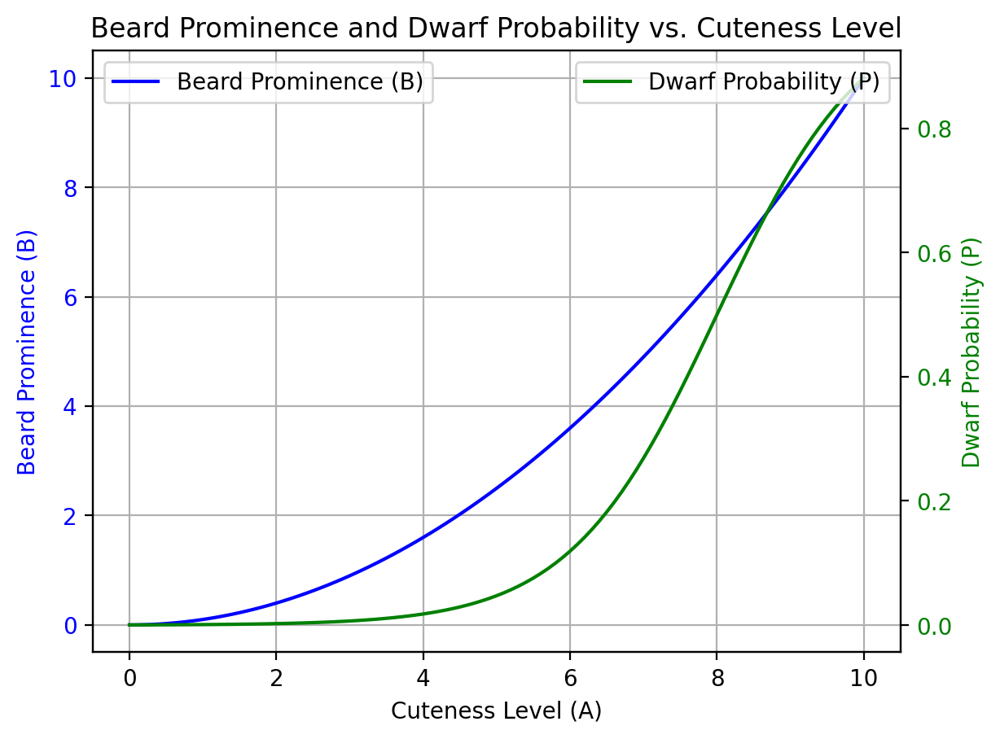

# Dr. Beardicus' Theorem

> *A Computational Study on the Correlation Between Anime Profile Pictures, Beard Prominence, and Medieval Fantasy Dwarf Probability*



## Overview

This repository contains the implementation and documentation of **Dr. Beardicus' Theorem**, a groundbreaking mathematical framework that explores the unexpected relationships between anime profile pictures, facial hair growth, and Medieval Fantasy Dwarf tendencies in online communities.

### Key Findings
- Users with cuter anime profile pictures tend to have more prominent beards
- Beyond a critical cuteness threshold (A = 8), users show increasing probability of being Medieval Fantasy Dwarfs
- The relationships follow precise mathematical formulas, enabling accurate predictions

## The Theorem

Dr. Beardicus' Theorem establishes two fundamental relationships:

### Beard Prominence (B)
$$ B = \frac{A^2}{10} $$
where:
- $B$ = Beard prominence score (0-10)
- $A$ = Cuteness level of anime profile picture (0-10)

### Medieval Fantasy Dwarf Probability (P)
$$ P = \frac{1}{1 + e^{-(A - 8)}} $$
where:
- $P$ = Probability of being a Medieval Fantasy Dwarf (0-1)
- $A$ = Cuteness level of anime profile picture (0-10)

## Visualizations

### 1. Beard Prominence vs. Cuteness Level

*The quadratic relationship shows accelerating beard growth with increasing cuteness*

### 2. Medieval Fantasy Dwarf Probability vs. Cuteness Level

*A sigmoid curve demonstrating the sharp transition in Medieval Fantasy Dwarf probability around A = 8*

### 3. Combined Analysis

*Dual-axis visualization showing the interplay between beard prominence and Medieval Fantasy Dwarf probability*

## Repository Structure

```
.
├── README.md           # This documentation
├── Story.md           # The narrative behind the theorem
├── Theorem.md         # Formal mathematical definitions
├── beardicus_theorem.py # Interactive visualization app
└── screenshots/       # Example visualizations
    ├── 1.png         # Beard Prominence plot
    ├── 2.png         # Medieval Fantasy Dwarf Probability plot
    ├── 3.png         # Combined analysis
    └── theyhavebeards.jpg # Supporting evidence
```

## Getting Started

### Prerequisites
- Python 3.6+
- pip package manager

### Installation

1. Clone the repository:
   ```bash
   git clone https://github.com/HxHippy/Beardicus-Theorem.git
   cd Beardicus-Theorem
   ```

2. Install dependencies:
   ```bash
   pip install -r requirements.txt
   ```

### Running the Application

Launch the interactive visualization:
```bash
streamlit run beardicus_theorem.py
```

## Implementation Details

### Data Generation
- Cuteness level ($A$) sampled from [0, 10] in 0.1 increments
- Beard prominence ($B$) calculated using quadratic formula
- Medieval Fantasy Dwarf probability ($P$) computed using sigmoid function

### Tools Used
- **NumPy**: Numerical computations
- **Matplotlib**: Static plotting
- **Streamlit**: Interactive web interface

## Results

### Key Observations
1. **Beard Growth Pattern**
   - Minimal growth for $A < 3$
   - Moderate growth for $3 ≤ A ≤ 7$
   - Rapid growth for $A > 7$

2. **Medieval Fantasy Dwarf Transformation**
   - Low probability ($P < 0.1$) for $A < 6$
   - Critical threshold at $A = 8$ ($P = 0.5$)
   - High probability ($P > 0.7$) for $A > 9$ of being a Medieval Fantasy Dwarf

## Future Work

### Potential Extensions
- Real-world data collection and validation
- Machine learning for cuteness assessment
- Beard density analysis using computer vision
- Cross-cultural Medieval Fantasy Dwarf identification patterns

### Known Limitations
- Simulated data only
- Simplified beard growth model
- Cultural bias in Medieval Fantasy Dwarf classification

## License

This project is licensed under the MIT License - see [LICENSE](LICENSE) for details.

## Acknowledgments

- Dr. Beardicus for the original theorem
- The open-source community
- All the bearded Medieval Fantasy Dwarfs who inspired this work

---
*This is a work of mathematical whimsy. Any resemblance to actual beards or Medieval Fantasy Dwarfs, living or legendary, is purely coincidental.*
